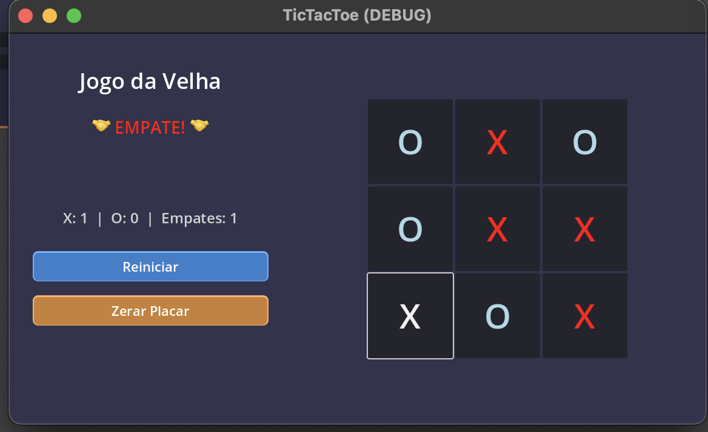
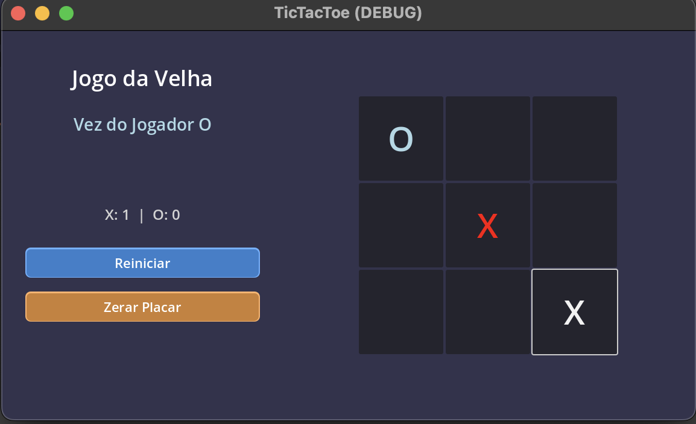

# 🎮 Jogo da Velha (Tic-Tac-Toe)

Um jogo da velha moderno e responsivo desenvolvido em Godot Engine com C#.

## 🎯 Sobre o Jogo

Jogo da velha clássico com interface moderna, sistema de pontuação e reinício automático. Dois jogadores se alternam colocando X e O em uma grade 3x3, tentando conseguir três símbolos em linha.

## ✨ Características

- **Interface Moderna**: Design 3D com cores dinâmicas para cada jogador
- **Sistema de Pontuação**: Contador de vitórias e empates
- **Reinício Automático**: O jogo reinicia automaticamente após 3 segundos
- **Visual Responsivo**: Layout adaptativo com espaçamento adequado
- **Controles Intuitivos**: Botões para reiniciar partida e zerar placar

## 🎮 Como Jogar

1. **Objetivo**: Consiga três símbolos iguais em linha (horizontal, vertical ou diagonal)
2. **Jogador X**: Começa sempre primeiro (cor vermelha)
3. **Jogador O**: Joga em seguida (cor azul claro)
4. **Vitória**: Os símbolos vencedores ficam dourados
5. **Reinício**: Aguarde 3 segundos para uma nova partida automática

## 🎨 Capturas do Jogo

### 📸 Screenshots

<div align="center">
  
  <br>
  <em>Tela de jogo - Estado inicial</em>
</div>

<br>

<div align="center">
  
  <br>
  <em>Tela de jogo - Partida em andamento</em>
</div>

### 🎥 Demonstração em Vídeo

<div align="center">
  <video width="400" controls>
    <source src="assets/video.mov" type="video/quicktime">
    Seu navegador não suporta o elemento de vídeo.
  </video>
  <br>
  <em>Demonstração completa do jogo</em>
</div>

## 🛠️ Tecnologias

- **Engine**: Godot 4.4.1
- **Linguagem**: C# (.NET 8.0)
- **Plataforma**: Desktop (Windows, macOS, Linux)

## 📁 Estrutura do Projeto

```
tictactoe/
├── README.md           # Este arquivo
├── TicTacToe.cs       # Lógica principal do jogo
├── TicTacToe.tscn     # Cena principal
├── project.godot      # Configuração do projeto
├── icon.svg          # Ícone do projeto
├── docs/             # Documentação técnica
└── assets/           # Screenshots e vídeo do jogo
    ├── game1.png     # Screenshot - Estado inicial
    ├── game2.png     # Screenshot - Partida em andamento
    └── video.mov     # Demonstração em vídeo
```

## 🚀 Como Executar

1. Abra o Godot Engine 4.4.1+
2. Importe o projeto selecionando `project.godot`
3. Pressione F5 ou clique em "Jogar"
4. Divirta-se!

## 🏆 Funcionalidades Especiais

- **Destaque de Vitória**: Linha vencedora fica dourada
- **Cores Dinâmicas**: Status muda de cor conforme o jogador ativo
- **Auto-restart**: Não precisa clicar para jogar novamente
- **Interface Profissional**: Botões 3D com efeitos hover e pressed

---

*Desenvolvido em Godot Engine para trabalho acadêmico*
